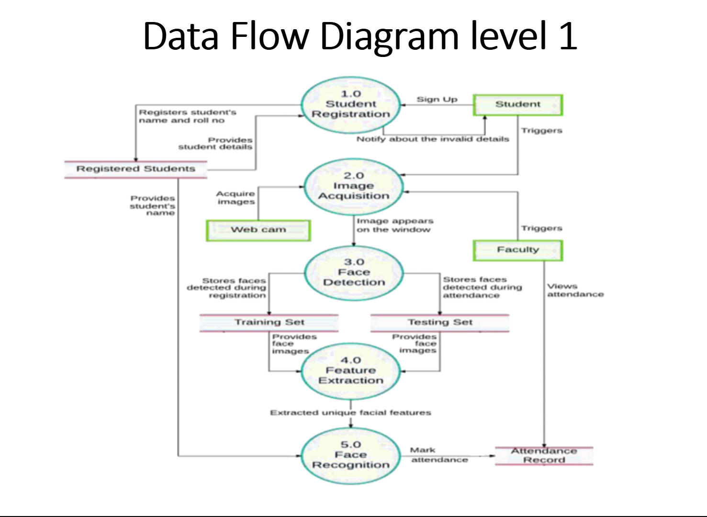

# Face-Recognition-Attendance-App

- This is the main project for the PowerToFly Hackthon-Oct-2022
- Here, we will be building a face-recognition-app that will provide proper authorization of all employees.

#### To run on local machine

```powershell
# the loacl must have following libs installed for app to work efficiently
pip install tk-tools
pip install opencv-contrib-python
pip install datetime
pip install pytest-shutil
pip install python-csv
pip install numpy
pip install pillow
pip install pandas
pip install times
# Then Fork or clone repo from
git clone https://github.com/mstomar698/face-recognition-attention--system
```

```python
# Once you have all libs installed just run
python main.py
```

- Leave a ⭐.

#### The functionality of app consists of

- The system has been proposed for maintaining the attendance record.
- The feature extraction process is used to increase the rate of face recognition technique.
- Even in the poor light available in the environment, the system will be able to capture the face of employee with high quality image.
- With help of lighter model and low weight GUI we reached more quick and efficient way or organising a facility for better attendance system.

#### Demo




#### Demo Video

[Video-demo-here](https://drive.google.com/file/d/1fLVI8yGjavLDpM6PX6eWBf-dDa2cWg8Y/view?usp=sharing)

##### Project By

- [Mebanpynsuk Rani Kyndait](https://github.com/Butterfly-Google-Dev)
- [Mayank Singh Tomar](http://github.com/mstomar698)

* Leave a ⭐.

* Licencse Under [MIT]().
